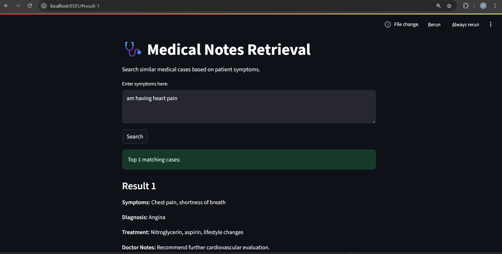

# 🩺 Medical Notes Assistant (ChromaDB + Streamlit)

This project is a **Retrieval-Based Medical Case Assistant** powered by **ChromaDB** and **Streamlit**.  
It allows you to query a database of medical notes using symptoms and retrieve the most similar cases from the vector database.

---

## 🚀 Features

- 📁 Ingests medical case notes from a CSV file
- 🔍 Queries similar patient cases using symptom matching
- 🧠 Uses ChromaDB for fast vector-based retrieval
- 🖥️ Streamlit UI for interactive querying

---

## 🖼️ UI Preview



---

## 📦 Installation

1. Clone the repository

```bash
git clone https://github.com/yourusername/medical-notes-assistant.git
cd medical-notes-assistant
